data-science-project-template
==============================

 <h2>1. Organización del proyecto </h2>

    ├── README.md          <- README principal para los desarrolladores usando este proyecto.
    ├── data
    │   ├── external       <- Datos de terceras fuentes.
    │   ├── interim        <- Datos intermedios que ya han sido transformados.
    │   ├── processed      <- Datos en forma final, listo para modelamiento.
    │   └── raw            <- Datos originales, datos inmutable sin ninguna transformación.
    │
    ├── docs               <- Documentación del proyecto, ver detalles.
    │
    ├── models             <- Modelos entrenados y serializados, predicción de los modelos y resúmenes.
    │
    ├── references         <- Diccionarios de datos, manuales y todos material que explique los datos.
    │
    ├── reports            <- Análisis generado puede ser como HTML, PDF, LaTex, etc.
    │   └── figures        <- Gráficos y figuras generados usados en los reports.
    │
    ├── src                <- Código principal para el uso del proyecto.
    │   ├── __init__.py    <- Convierte al folder en un modulo de Python.
    │   │
    │   ├── _01_Business_Understanding      <- Exploración inicial para entender el negocio.
    │   │
    │   ├── _02_Data_Understanding          <- Exploración para entender los datos y sus disponibilidad.
    │   │
    │   ├── _03_Data_Preparation            <- Seleccionar, ordenar, agrupar, remover, etc. los datos para alcanzar los objetivos.
    │   │
    │   ├── _04_Modeling                    <- Scripts para generación del modelo y afinamiento de parámetros.
    │   │
    │   ├── _05_Evaluation                  <- Scripts para evaluación de resultados establecidos al inicio del proyecto.
    │   │
    │   └── _06_Deployment                  <- Scripts para el despliegue y pase a producción.
    │   
    ├── enviroment.yml              <- Archivo con listado de los paquetes necesarios para reproducir el entorno de análisis.
    │
    ├── 00.create_env.bat           <- Ejecutable para crear el entorno virtual con los parámetros del archivo "enviroment.yml".
    │
    └── 01.update_enviroment.bat    <- Ejecutable para actualizar el archivo "enviroment.yml" antes de ser compartido.

--------
<h2>2. Configuración del entorno del proyecto</h2>

1. Descargar e instalar Anaconda del siguiente enlace: <a target="_blank" href="https://www.anaconda.com">https://www.anaconda.com/</a>.

<b>Recomendación:</b> durante la instalación poner atención al siguiente cuadro de diálogo en la cual debe seleccionar ambos recuadros

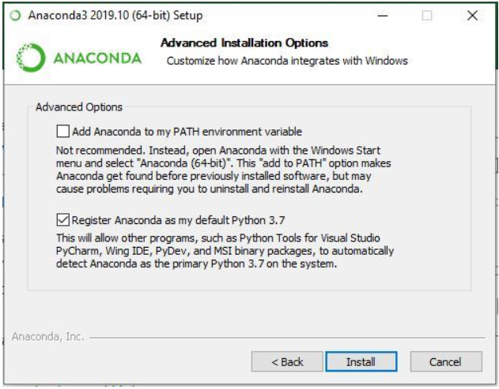

2. Como IDE se recomienda usar el Visual Studio Code el cual se puede descargar del siguiente enlace: <a target="_blank" href="https://code.visualstudio.com/Download">https://code.visualstudio.com/Download/</a>.

3. Clonar el proyecto desde el repositorio de GitHub y localizarlo en el folder de su preferencia.

<bNOTA:</b> El proyecto clonado contiene el archivo <b>environment.yml</b> el cual permite configurar el nombre del entorno virtual y la gestión de las dependencias/librerías. Por defecto, el nombre del entorno virtual es <b>venvOsee</b>. Sin embargo, se recomienda que se cambie a un nombre que haga referencia al proyecto que se pretende desarrollar.

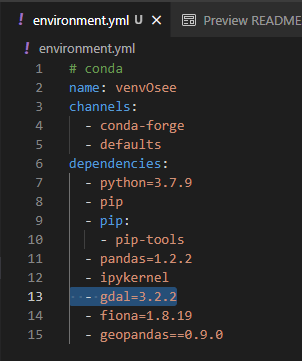

4. Ejecutar el archivo <b>00.create_env.bat</b> para crear entorno virtual del proyecto. en la pantalla se mostrará una imagen que indica que se está creando el entorno.

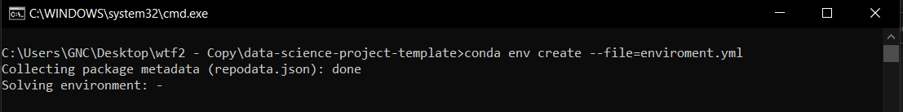

5. Una vez instalado ambos programas (Anaconda y Visual Studio Code), abrir el editor Visual Studio Code y en la pestaña File hacer <i>click</i> para abrir el folder donde hemos clonado el proyecto (paso 3.).

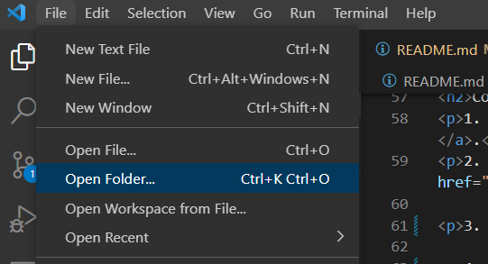

6. En el visual Studio Code abrimos una nueva terminal y ejecutamos el comando <b>conda activate venvOsee</b> para activar nuestro entorno virtual.

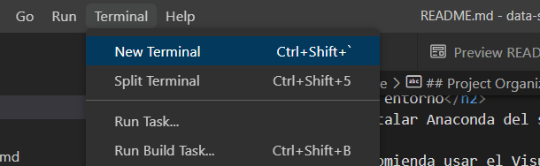

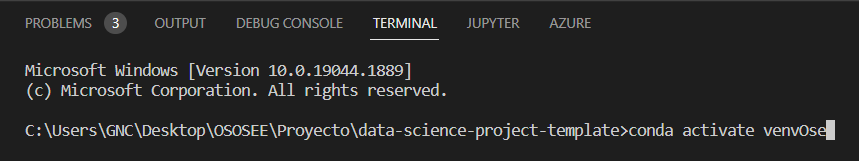

7. Una vez activado nuestro entorno virtual en el terminal se mostrará lo siguiente: <b>(venvOsee) C:\Users\GNC\Desktop\OSOSEE\Proyecto\data-science-project-template></b>. el nombre del entorno virtual "<b>venvOsee</b>" se muestra al inicio como se muetsra en la figura lo cual nos asegura que ya estamos en nuestro entorno virtual y podemos ejecutar nuestros scripts con el compilador del entorno virtual

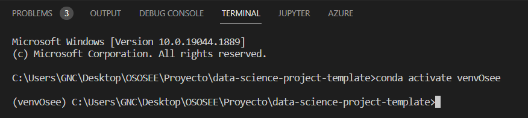

8. Ya podemos ejecutar cada unos de los scripts.

<b>Nota 1:</b> Para ejecutar un script completo debemos dirigirnos a la carpeta donde se encuentra el scripts mediante los comandos "cd Nombre_de_carperta" y escribir en el terminal "python nombre_de_scripts", debemos incluir la extensión del archivo, en nuestro caso será ".py"

<b>Nota 2:</b> Para ejecutar una sección del script debemos seleccionar la parte del código que deseamos ejecutar, luego presionar <i>click</i> derecho y seleccionar la opcion <b>Run Selection/Line in Python Terminal</b> en las opciones que se mostrarán. Otra forma más rápida es seleccionar el código que se desea ejecutar y presionar las teclas <b>Shift + Enter</b>

<b>Nota 3:</b> En la parte derecha inferior de nuestro IDE, debemos seleccionar nuestro entorno virtual, de este modo el IDE inicializará un terminal con nuestro entorno virtual por defecto.

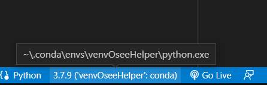

<h2>3. Instalacion/Actualizacion de nuevos paquetes</h2>

1. Agregamos el nombre de la librería con su versión en el archivo <b>environment.yml</b> manteniendo su estructura en la sección <b>dependencies</b>, según como se muestra a continuación.

2. Después de asegurarnos haber guardado el archivo con la nueva librería, debemos asegurarnos que en el archivo <b>01.update_enviroment.bat</b>, se encuentre el nombre del entorno virtual que se desea actualizar, según como se muestra en la imagen.

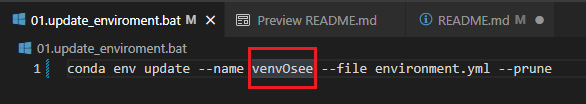

3. Finalmente se ejecuta el archivo <b>01.update_enviroment.bat</b>, dándole doble Click y esperamos a que se actualice el entorno virtual.

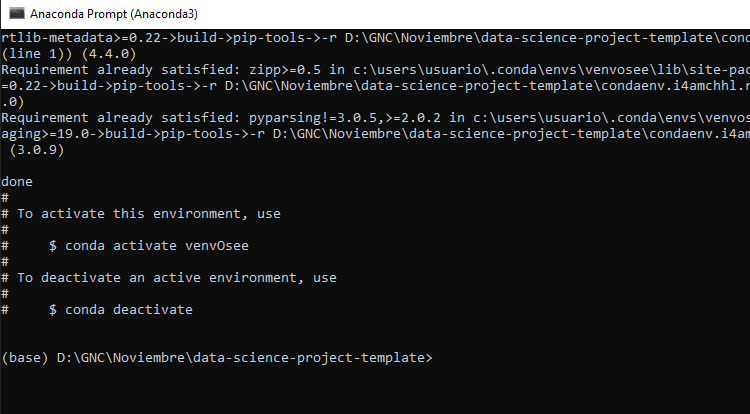

<h2>4. Transferir proyecto</h2>

1. Para compartir el proyecto con un colaborador solo debemos compartir el archivo <b>enviroment.yml</b> con las ultimas versionas instaladas de cada libreria dentro del entorno virtual.

<h2>5. Rutas para navegar por los scripts </h2>

En esta sección se establecen las rutas para navegar por los scripts.

1. Ir al script [03DataPreparation.py](src/_03_Data_Preparation/DataPreparation.py)

2. Ir al script  [04Modeling.py](src/_04_Modeling/Modeling.py)

<h2>6. Uso de la plantilla <b><a target="_blank" href="https://github.com/ecandela/data-science-project-template">data-science-project-template</a></b>.</h2>

1. Para el uso de esta plantilla en algún proyecto nuevo, primero nos dirigimos al botón verde <b>“Use this template”</b>.

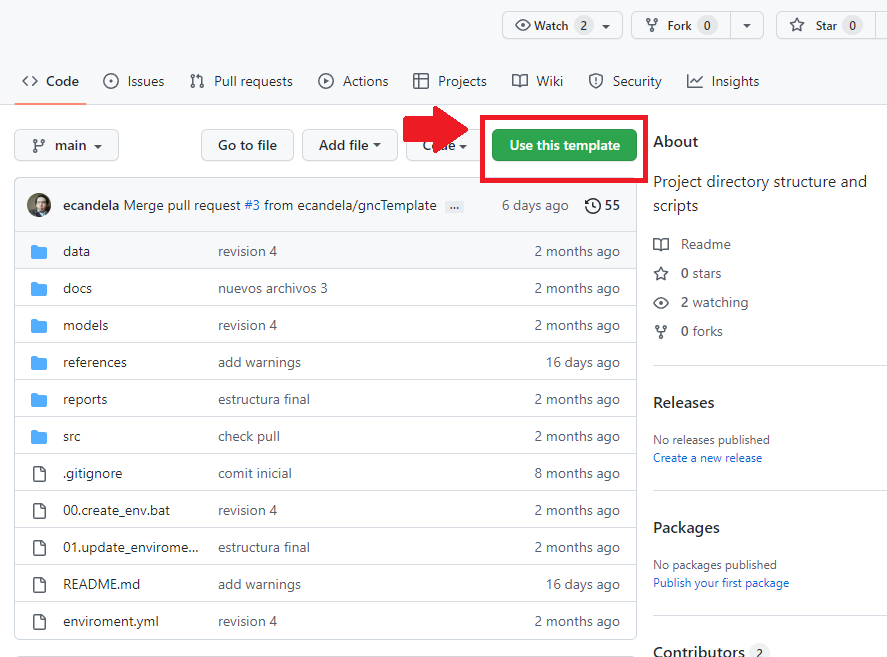

2. Seguidamente llenamos los campos <b>Repository Name</b> y <b>Description</b> correspondientes al nombre del proyecto y su descripción. Puedes seleccionar si será público o privado y además si desea incluir todas las ramas del proyecto.

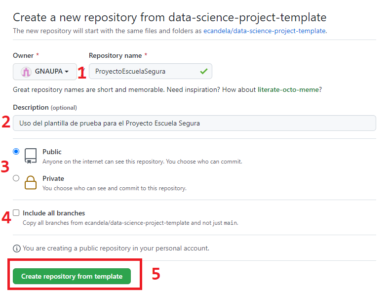

3. Finalmente presionar el botón <b>Create Repository From Template</b> para crear un nuevo repositorio a partir de la plantilla, obteniendo el siguiente resultado:

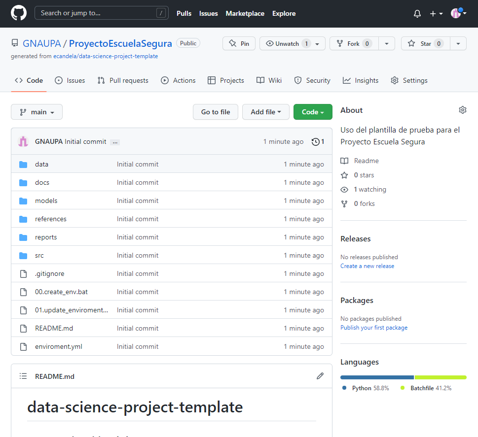

<h2>7. Resumen de documentacion. </h2>

En esta sección hace una breve descripción del proyecto y se establecen los enlaces para navegar por los documentos necesarios. Ejemplo:

El proyecto MODELAMIENTO DE PORCENTAJE ABANDONO se evaluo en 6 fases...

[Ver documentacion fase 01](docs/README01.md) \
[Ver documentacion fase 02](docs/README02.md) \
[Ver documentacion fase 03](docs/README03.md) \
[Ver documentacion fase 04](docs/README04.md) \
[Ver documentacion fase 05](docs/README05.md) \
[Ver documentacion fase 06](docs/README06.md)
